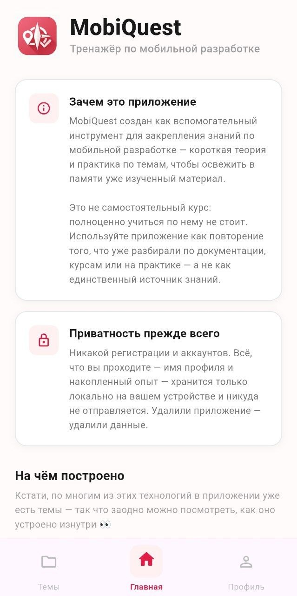
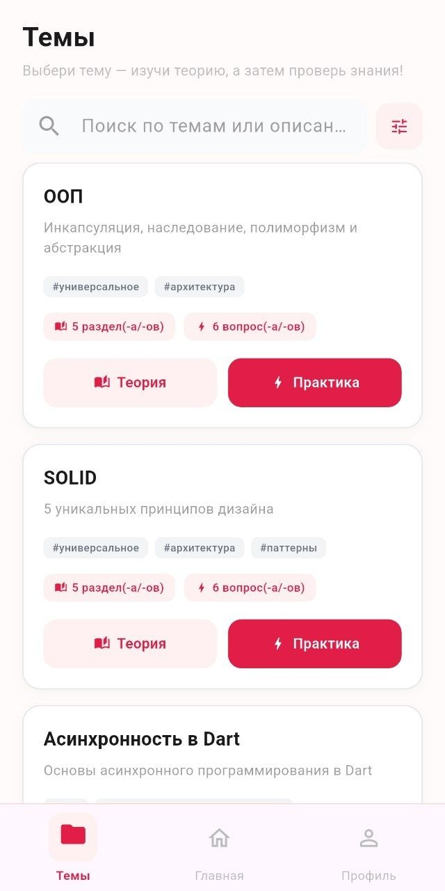
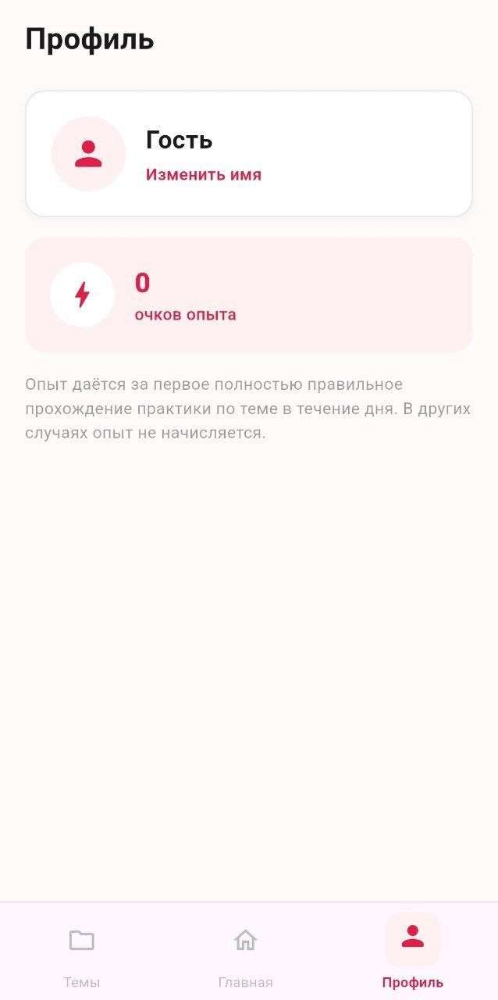

**[Читать на русском языке](README.ru.md)**

# MobiQuest

A mobile app that helps Flutter developers learn and reinforce their knowledge through short topic-based quizzes and concise theory summaries.

## Screenshots

<table align="center">
  <tr>
    <td align="center">
       
    </td>
    <td align="center">
       
    </td>
    <td align="center">
       
    </td>
  </tr>
</table>

## Functionality

- Short quizzes on various Flutter and mobile development topics
- Concise theory summaries for each topic
- Adding new themes without having to update the app
- User profile with earned experience

## Technologies

- **Flutter** — UI framework
- **BLoC** — State management
- **Hive** — Local storage
- **Dio** — Networking

## Development Principles

- Clean Architecture
- SOLID principles
- Repository Pattern
- Dependency Injection (get_it)
- Responsive UI - all sizes are calculated from the screen width

## Installation

### Download APK (Android)
Go to [Releases](https://github.com/daniilpaschenko/mobiquest/releases) and download the APK for your device